<!-- ANIMATED HEADER BANNER -->
<div align="center">

[](https://raviaivisuals.ravicomputer.com)

</div>

---

<!-- TERMINAL TYPING ANIMATION -->
<div align="center">

[](https://raviaivisuals.ravicomputer.com)

</div>

---

<!-- DUAL IDENTITY SECTION -->
<table width="100%">
<tr>
<td width="50%" valign="top">

## 🎨 AI CREATIVE DIRECTOR

```yaml
Name     : Ravi Parmar
Role     : AI Solutions Freelancer
Focus    : AI Image & Video Generation
Tools    : MidJourney · RunwayML · ElevenLabs
          Stable Diffusion · Suno AI · n8n
Status   : 🟢 Open for Projects
Portfolio: raviaivisuals.ravicomputer.com
```

</td>
<td width="50%" valign="top">

## 🧠 DATA ANALYST BACKGROUND

```yaml
Certified : Google Data Analytics
Skill     : HackerRank 3★ SQL
Stack     : Python · Pandas · Power BI
           scikit-learn · TensorFlow
Approach  : Data-driven creative decisions
Mindset   : I don't just generate — I solve
```

</td>
</tr>
</table>

---

## ⚡ AI PRODUCTION PIPELINE

```mermaid
flowchart LR
    A([📋 Client Brief]) --> B([✍️ AI Script\nClaude · Gemini])
    B --> C([🎙️ Voice Generation\nElevenLabs · Google Flow AI])
    C --> D([🎬 Video Generation\nRunwayML · MidJourney])
    D --> E([🎵 Music & Sound\nSuno AI])
    E --> F([✂️ Post Production\nPremiere Pro · After Effects])
    F --> G([🚀 Delivered Ad])

    style A fill:#1a1a2e,color:#00d4ff,stroke:#00d4ff
    style B fill:#1a1a2e,color:#00d4ff,stroke:#00d4ff
    style C fill:#1a1a2e,color:#00d4ff,stroke:#00d4ff
    style D fill:#1a1a2e,color:#00d4ff,stroke:#00d4ff
    style E fill:#1a1a2e,color:#00d4ff,stroke:#00d4ff
    style F fill:#1a1a2e,color:#00d4ff,stroke:#00d4ff
    style G fill:#00d4ff,color:#000000,stroke:#00d4ff
```



---

## 🤖 n8n AUTOMATION PIPELINE


---

## 💻 TECH STACK

### 🤖 AI & Generative Tools


### 🎨 Adobe Creative Suite


### 📊 Data, ML & Analytics


### 🗄️ Databases


### 🛠️ Dev & Tools


---

## 📊 GITHUB STATS

<div align="center">

<br/>
<br/>


</div>

---

## 🏆 GITHUB TROPHIES

<div align="center">


</div>

---

## 📈 CONTRIBUTION GRAPH

<div align="center">

[](https://github.com/RaviParmar1710)

</div>

---

## 🌐 CONNECT WITH ME

<div align="center">

[](https://linkedin.com/in/ravi-parmar17)
[](https://raviaivisuals.ravicomputer.com)
[](mailto:ravi.aivisuals@gmail.com)

</div>

---

<!-- FOOTER BANNER -->
<div align="center">

[](https://raviaivisuals.ravicomputer.com)


*"I don't just generate — I solve real problems with AI."*

</div>
